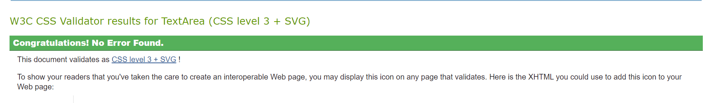

## HTML validations

#### Home page

#### Profile page

#### Css validation

[Link to app](https://users.metropolia.fi/~mirohi/WebOhjelmointi/EduBite/Front/home.html)

[Link to public/html](https://users.metropolia.fi/~mirohi/WebOhjelmointi/EduBite/)

### Ominaisuudet

- Asiakkaan kirjautuminen/rekisteröityminen
- Asiakas voi valita suosikkiravintolan joka piirtyy karttaan. (Sisältää bugin kun uuden suosikin on valinnut jättää vanhan merkittynä vielä, sivun uusiksi lataamalla piirtää sen hetkisen suosikin)
- Asiakas voi päivittää omia tietojaan
- Asiakas voi lisätä profiilikuvan
- Ravintolat ovat listattu selkeästi ja loogisesti
- Ravintolat ovat kartalla
- Lähin ravintola on korostettu
- Minimivaatimukset
- Ravintolat voi järjestellä etäisyyden mukaan klikkaamalla Distance nimeä tai Akkosten mukaan klikkaamalla Name tekstiä ravintoloinen yläpuolella.
